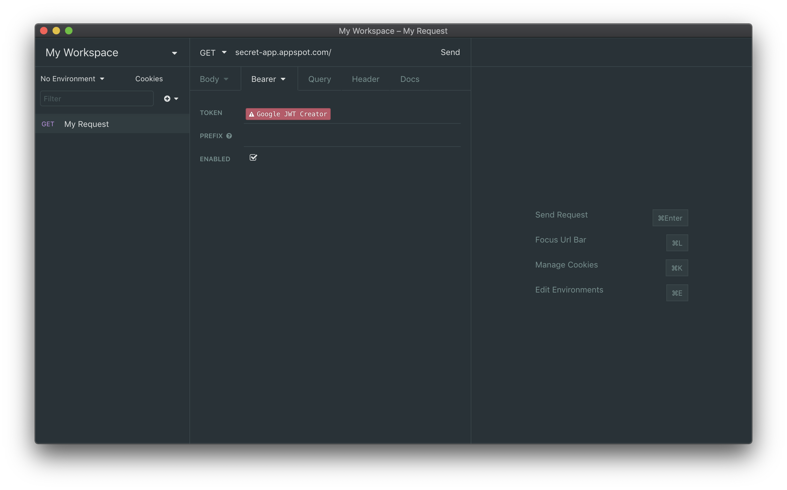
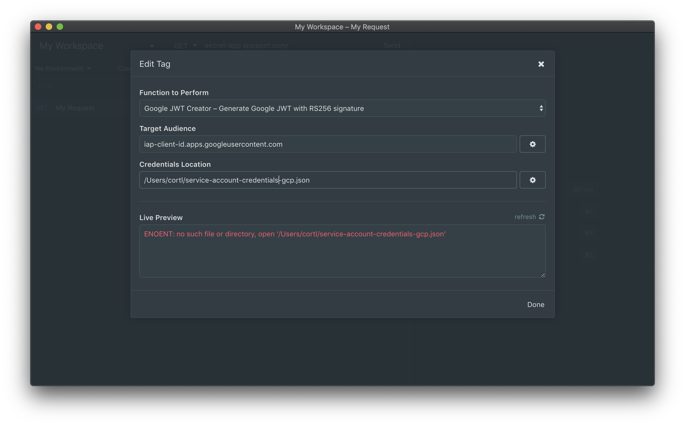

# Insomnia Plugin for Google JWT 🔌
This is a plugin for [Insomnia](https://insomnia.rest/) that creates an OICD token for calling your services behind IAP using a sevice account credentials

## Installation 💾
Install the insomnia-plugin-googlejwt plugin from Preferences > Plugins

## Usage 👨‍💻

Add the Google JWT Creator template tag underneath the Authorization Bearer token spot

Fill in the target audience field, which is located in your Google Cloud Console.
1. Go to Cloud IAP page.
2. Find the resource you want to access, then click More > **Edit OAuth Client**
3. On the **Credentials** page that appears, the "Client ID" is your Target Audience.

Fill in the credentials location with the fully unqualified location of your service account credentials.

That's it! 🎉